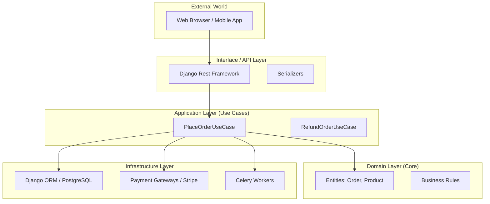
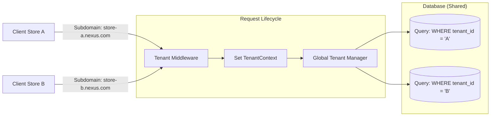
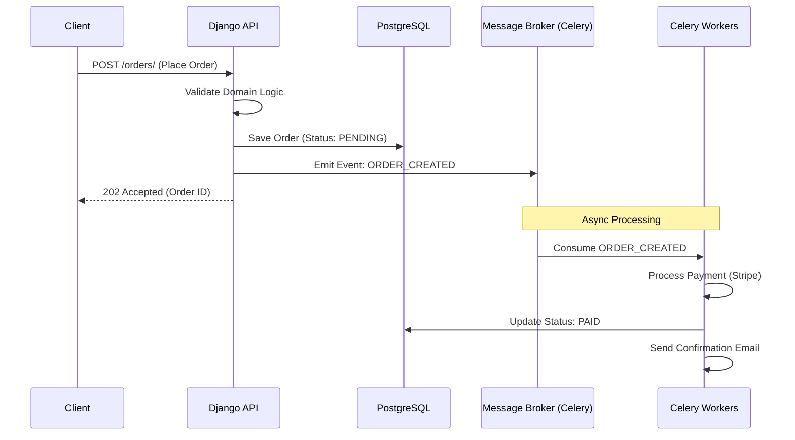
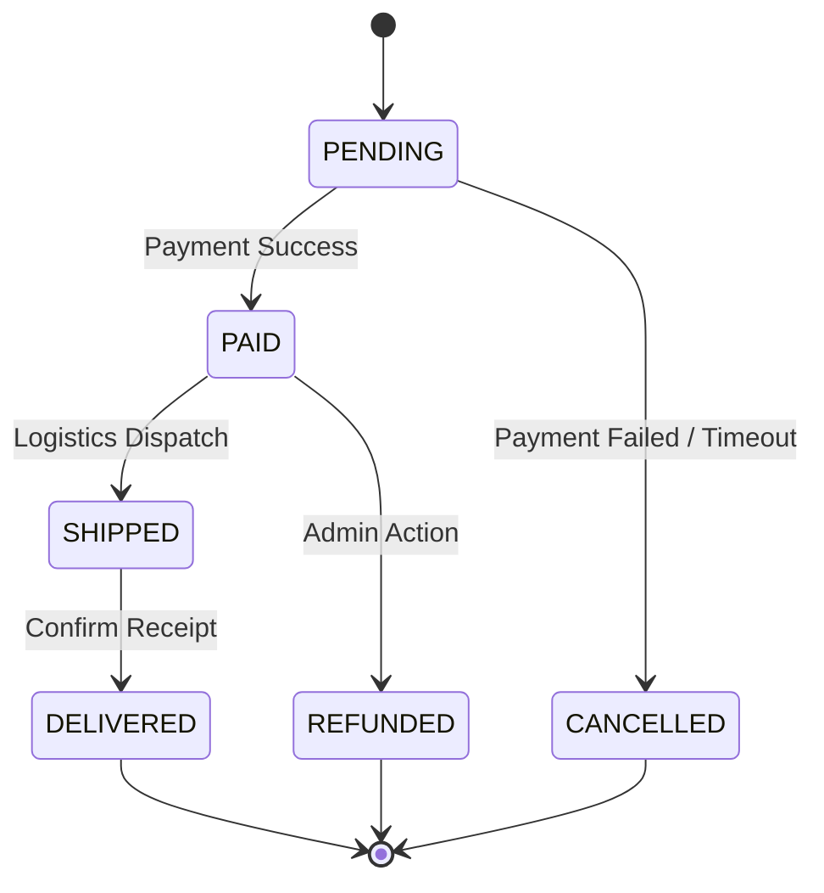
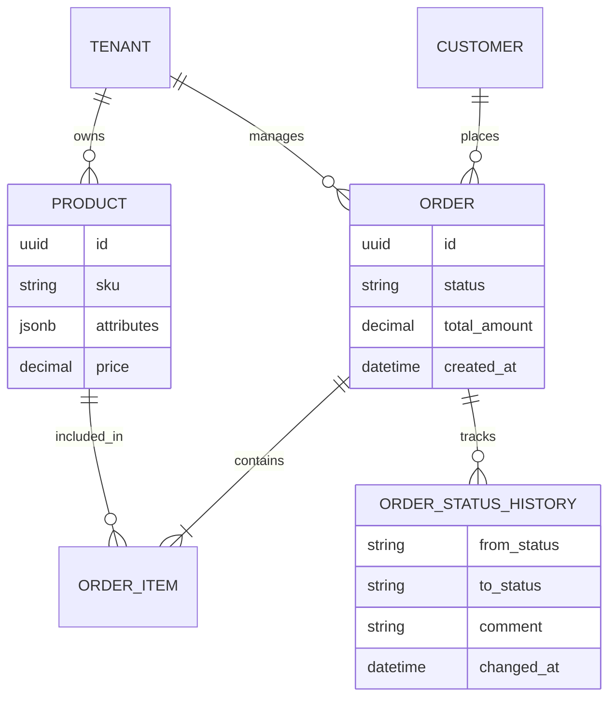
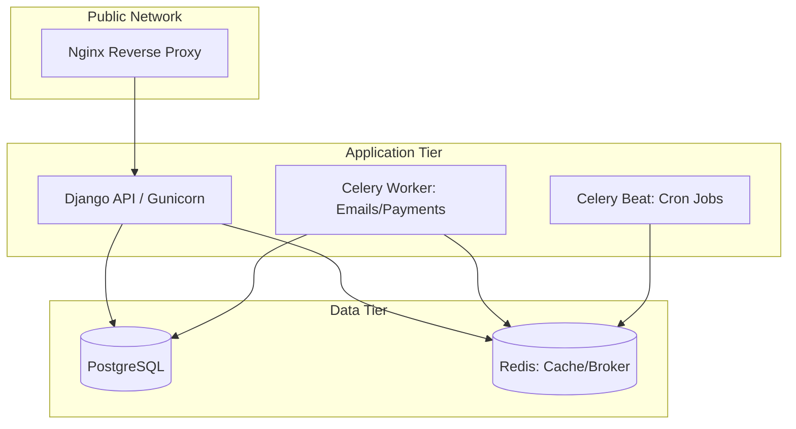

# Architecture Decision Records & System Design: Nexus OMS

Este documento detalla las decisiones arquitectónicas, patrones de diseño y la estructura técnica de **Nexus**, una plataforma SaaS de E-commerce Multi-tenant.

---
> ⚠️ Nota para reviewers  
> Este documento describe la **arquitectura objetivo** de Nexus OMS.  
> Algunas secciones están ya implementadas en código y otras en fase de diseño.  
> Cuando una sección esté parcialmente implementada, lo indicamos explícitamente.
---

## 🧩 Resumen ejecutivo

- **Estilo arquitectónico**: Clean / Hexagonal + DDD ligero.[page:6]
- **Capas principales**:
  - Domain: entidades, value objects, reglas de negocio, domain events.
  - Application: casos de uso, orquestación, puertos de entrada/salida.
  - Infrastructure: repositorios concretos (Django ORM), adaptadores externos.
  - Interfaces: API REST (DRF), futuros paneles web y Webhooks.[page:6]
- **Multi-tenant**:
  - Tenant como bounded context transversal.
  - Aislamiento por `tenant_id` en repositorios.
  - Middleware para resolución de tenant por subdominio/headers (diseñado).[page:6]
- **Procesos asincrónicos**:
  - Domain events publicados desde el dominio.
  - Handlers en Application/Infrastructure disparando tareas Celery.[page:6]

---

## 1. Visión General del Proyecto
**Nexus** no es solo un carrito de compras; es un **Order Management System (OMS)** diseñado para alta disponibilidad y escalabilidad. Su propósito es permitir que múltiples empresas (Tenants) gestionen catálogos y pedidos complejos desde una infraestructura única, manteniendo un aislamiento total de datos y lógica de negocio extensible.

### Diagrama de Flujo: HTMX + Django + Celery

```mermaid
sequenceDiagram
    participant U as Usuario (HTMX)
    participant D as Django View
    participant C as Celery Worker
    participant R as Redis (State)

    U->>D: POST /orders/1/pay (hx-post)
    D->>C: Delay Task: ProcessPaymentTask
    D-->>U: Return HTML Snippet (Status: Processing...)
    
    loop Polling with hx-get
        U->>D: GET /orders/1/status
        D->>R: Check Task Status
        R-->>D: Task Completed
        D-->>U: Return HTML Snippet (Status: Paid ✅)
    end
```

---

## 2. Estructura de Capas (Clean Architecture)
Para evitar el acoplamiento excesivo al framework Django, el proyecto se divide en cuatro capas concéntricas:

### 2.1  Diagrama de la Arquitectura de Capas (Clean Architecture)

Este diagrama muestra cómo las dependencias siempre apuntan hacia adentro, hacia el Dominio.

* **Dominio (Domain):** El corazón del sistema. Contiene las **Entidades** (clases Python puras como `Order`, `Product`) y **Servicios de Dominio**. No importa qué base de datos o API usemos; las reglas de oro del negocio viven aquí.
* **Aplicación (Application):** Define los **Casos de Uso** (ej. `PlaceOrderWorkflow`). Orquestan la interacción entre el dominio y los servicios externos.
* **Infraestructura (Infrastructure):** Implementaciones concretas. Aquí reside el **Django ORM**, los clientes de Stripe/PayPal, y el sistema de archivos.
* **Interfaz (Interface/API):** El punto de contacto externo. Incluye los **ViewSets** de Django Rest Framework, Serializers y documentación Swagger.

### Domain Layer

- No conoce nada de Django, DRF ni de la base de datos.
- Contiene:
  - Entidades como `Order`, `OrderItem`, `Product`, `Customer`.
  - Value Objects como `OrderId`, `Money`, `Quantity`.
  - Servicios de dominio para reglas complejas (por ejemplo, validación de inventario).
  - Eventos de dominio como `OrderPlaced`, `OrderCancelled`, `StockAdjusted`.

> Implementación actual  
> - [ ] Entidades y eventos definidos como módulos Python puros.  
> - [ ] Aún no se han conectado todos a la capa de aplicación.[page:6]

### Application Layer

- Define **casos de uso** (use cases) como servicios de aplicación:
  - `PlaceOrderService`
  - `CancelOrderService`
  - `ShipOrderService`.
- Usa **puertos** (interfaces) para hablar con:
  - Repositorios de órdenes/productos.
  - Servicios externos (pagos, notificaciones, etc.).

Relación con Django:
- Las views de DRF llaman a estos servicios, no directamente al ORM.
- La lógica de validación compleja se concentra aquí o en el dominio, no en serializers.

### Infrastructure Layer

- Implementa los puertos definidos en Application:
  - `DjangoOrderRepository` (usa models y queryset).
  - `PostgresTenantRepository`.
  - Adaptadores para Celery, correo, colas, etc.[page:6]
- Aquí sí aparece Django ORM, settings, logging y detalles de la base de datos.

> Implementación actual  
> - [ ] Primeros repositorios esbozados.  
> - [ ] Pendiente consolidar todas las dependencias de Django en esta capa.

### Interface Layer (API / UI)

- API REST (DRF) como punto de entrada principal.
- Panel web (Django templates o SPA externa) como consumidor secundario.
- Webhooks para integración con plataformas externas (Shopify, etc.).

Principio clave:
> Las views/controladores son **adaptadores** muy delgados: validan input, construyen DTOs y delegan a la Application Layer.

---

## 3. Pilares "Invisibles" de Ingeniería

### A. Multi-tenancy (Estrategia de Aislamiento)
Se ha implementado una estrategia de **Shared Database con Discriminador**.
* **Mecanismo:** Un Middleware identifica al `tenant` mediante el subdominio o el header `X-Tenant-ID`.
* **Seguridad:** Se utiliza un `Global Tenant Manager` en los modelos de Django que añade automáticamente un filtro `WHERE tenant_id = X` a todas las consultas, previniendo la fuga de datos (Data Leakage) entre clientes.

### Diagrama de Aislamiento Multi-tenant (Middleware)
Este es crucial para explicar el pilar "invisible". Muestra cómo el sistema decide qué datos mostrar dependiendo de quién pregunta.

### B. Arquitectura Orientada a Eventos (EDA)

El sistema utiliza un bus de mensajes (Celery/Redis) para desacoplar procesos pesados.
* **Flujo:** Al completar un pedido, el dominio emite un evento `OrderConfirmed`.
* **Consumidores:** Workers de **Celery** capturan este evento para:
    1.  Generar la factura legal (PDF).
    2.  Sincronizar el inventario con almacenes externos.
    3.  Enviar notificaciones push/email.

### Diagrama de Flujo del Proceso de Compra (Asíncrono)

Este explica el pilar "invisible" de la Arquitectura Orientada a Eventos (EDA).

---

## 4. Patrones de Diseño Clave

| Patrón | Propósito en Nexus |
| :--- | :--- |
| **Repository Pattern** | Abstrae el ORM de Django. Los Casos de Uso piden datos a una interfaz, no a `Model.objects.all()`. |
| **Strategy Pattern** | Utilizado en el **Motor de Promociones** para intercambiar algoritmos de descuento (2x1, % fijo, envío gratis) en tiempo de ejecución. |
| **State Pattern (FSM)** | Controla el flujo de los pedidos. Evita estados inválidos (ej. pasar de `CANCELLED` a `SHIPPED`). |
| **Dependency Injection** | Los repositorios se inyectan en los Casos de Uso, permitiendo realizar Unit Testing real sin tocar la base de datos. |

### Diagrama de la Máquina de Estados (Order Life Cycle)

Este demuestra el uso de FSM (Finite State Machine) en el módulo de Pedidos.

---

## 5. Architecture Decision Records (ADRs)

### ADR 001: Adopción de Monolito Modular vs Microservicios
* **Contexto:** El proyecto requiere alta cohesión pero debe ser fácil de desplegar.
* **Decisión:** Usar un Monolito Modular donde cada app de Django es un "Bounded Context" de DDD.
* **Consecuencia:** Facilidad de desarrollo inicial con una ruta clara para extraer módulos a microservicios si la carga lo requiere.

### ADR 002: Lógica de Negocio fuera de los Modelos
* **Contexto:** Django promueve "Fat Models", lo que dificulta las pruebas y el mantenimiento.
* **Decisión:** Los modelos de Django son solo esquemas de persistencia. La lógica reside en `domain/services.py`.
* **Consecuencia:** Código más verboso pero extremadamente fácil de testear con `pytest`.

### ADR 003: PostgreSQL para Datos Relacionales + JSONB
* **Contexto:** Los productos tienen atributos dinámicos (talla, color, voltaje).
* **Decisión:** Usar PostgreSQL con campos **JSONB** para atributos variables, manteniendo el rigor relacional para transacciones financieras.

---

## 6. Diagrama de Flujo de Datos (Pedido)

1.  **Request:** Cliente envía POST a `/api/orders/`.
2.  **API Layer:** El Serializer valida el formato.
3.  **Application Layer:** El Caso de Uso `CreateOrder` pide al `InventoryRepository` validar stock.
4.  **Domain Layer:** La entidad `Order` calcula totales y aplica impuestos.
5.  **Infrastructure Layer:** El `DjangoOrderRepository` guarda en Postgres.
6.  **Events:** Se dispara tarea asíncrona en Celery para el pago.

---

## 7. Modelado de Datos.

### 7.1. Diagrama de Relación de Entidades (ERD) - Enfoque OMS
Este diagrama muestra cómo se estructuran los datos para soportar el módulo complejo (OMS) y el Multi-tenancy.

---

## 8. Despliegue y DevOps.

### Diagrama de Infraestructura (Docker Compose)
Este diagrama ayuda a visualizar cómo interactúan todos los servicios del stack tecnológico. Es el mapa de tu docker-compose.yml.

