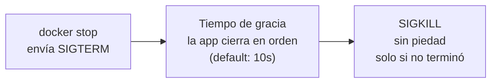
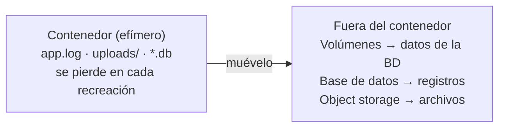
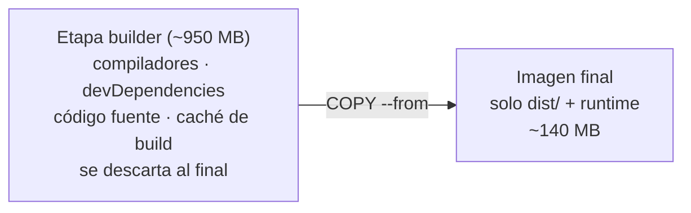

# De desarrollo a producción — Checklist Docker

> La checklist completa para convertir tu contenedor Docker en uno que aguante tráfico real: salud, seguridad, recursos, logs y todo lo que nadie te contó en el tutorial.
> 

---

## Antes de empezar: ¿por qué existe esta guía?

Tu app funciona en tu máquina. Corres el `docker run`, abres el navegador, todo verde. Y entonces alguien dice la frase peligrosa: **"pues súbela a producción, si ya funciona"**.

Ahí está la trampa. "Funciona" y "aguanta producción" son dos cosas distintas. En tu máquina nadie más la usa, la memoria sobra, y si algo truena lo reinicias tú. En producción no estás mirando: se acaba la RAM a las 3 a.m., se cae la base de datos, alguien reinicia el servidor sin avisar.

Esta guía es la checklist que me hubiera gustado tener en mi primer despliegue. Cada capítulo ataca un frente distinto: primero el problema en lenguaje plano, después el término técnico (para que lo reconozcas en la documentación) y el código listo para copiar.

**¿Cómo usarla?** No necesitas aplicar todo el mismo día. Recorre los capítulos en orden, marca cada casilla cuando la tengas cubierta, y vuelve antes de cada despliegue importante.

---

## 1. Salud y disponibilidad

*Que el contenedor esté "encendido" no significa que esté funcionando. Este capítulo trata de enseñarle a Docker a distinguir una cosa de la otra.*

Imagina un restaurante con las luces prendidas y la puerta abierta… pero sin nadie en la cocina. Desde afuera parece operativo; por dentro, no puede atender a nadie. A los contenedores les pasa igual: el proceso puede estar vivo mientras la aplicación por dentro está congelada, sin conexión a la base de datos o atrapada en un error.

- [ ]  **Configurar un chequeo de salud (HEALTHCHECK)**

Docker, por defecto, solo verifica que el proceso exista. Con la instrucción `HEALTHCHECK` le das una prueba concreta que ejecutar cada cierto tiempo — como un doctor que pasa a preguntar "¿cómo te sientes?" en lugar de solo mirar si respiras.

```docker
# Dockerfile
HEALTHCHECK --interval=30s --timeout=3s --retries=3 \
  CMD wget -qO- http://localhost:3000/health || exit 1
```

Traducción: cada 30 segundos, pregunta al endpoint `/health`. Si tarda más de 3 segundos o falla 3 veces seguidas, el contenedor pasa a estado `unhealthy` y tu orquestador puede reaccionar.

- [ ]  **Exponer un endpoint /health**

Es la ruta que responde a ese chequeo. Dos reglas de oro: debe responder **rápido** (milisegundos, no segundos) y comprobar **solo dependencias críticas**. Si tu app no puede vivir sin la base de datos, chequéala. Si el servicio de emails está caído pero la app puede seguir vendiendo, eso no debería tumbar tu health check.

```jsx
// Node.js / Express — simple y suficiente
app.get('/health', async (req, res) => {
  try {
    await db.query('SELECT 1');  // ¿responde la BD?
    res.status(200).json({ status: 'ok' });
  } catch {
    res.status(503).json({ status: 'error' });
  }
});
```

- [ ]  **Diferenciar "estoy vivo" de "estoy listo"**

Son dos preguntas distintas que suelen confundirse:

- **"¿Estoy vivo?"** — el proceso funciona y no hay que reiniciarlo. En el mundo de la orquestación esto se llama *liveness*.
- **"¿Estoy listo para recibir tráfico?"** — ya calenté cachés, ya conecté a la base de datos, ya puedo atender usuarios. Esto se llama *readiness*.

Una app arrancando está viva pero **todavía no está lista**. Si le mandas tráfico en ese momento, los primeros usuarios reciben errores. Separarlas en dos endpoints (`/health/live` y `/health/ready`) te costará 10 minutos hoy, y si mañana migras a Kubernetes, este trabajo ya estará hecho: son exactamente sus *liveness probe* y *readiness probe*.

| Momento | ¿Vivo? | ¿Listo? | ¿Recibe tráfico? |
| --- | --- | --- | --- |
| Arrancando | No | No | No |
| Proceso arriba, BD sin conectar | Sí | No | No |
| BD conectada, caché lista | Sí | **Sí** | **Sí** |
| Se cae la BD | Sí | No | No |

---

## 2. Recuperación automática

*En producción los contenedores se caen. La pregunta no es si pasará, sino qué hace tu sistema cuando pase: ¿espera a que un humano se despierte, o se levanta solo?*

- [ ]  **Configurar una política de reinicio (restart policy)**

Es una instrucción que le dejas a Docker: "si este contenedor se muere, levántalo de nuevo sin preguntarme". Sin ella, un crash a medianoche significa servicio caído hasta que alguien lo note.

```yaml
# docker-compose.yml
services:
  api:
    image: mi-api:1.4.2
    restart: unless-stopped
```

| Política | Qué hace | ¿Cuándo usarla? |
| --- | --- | --- |
| `no` | Nunca reinicia (es el default) | Solo desarrollo |
| `on-failure` | Reinicia solo si terminó con error | Tareas puntuales, jobs |
| `unless-stopped` | Reinicia siempre, salvo que TÚ lo detuviste | Servicios en producción (recomendada) |
| `always` | Reinicia siempre, incluso tras reiniciar el servidor | Similar, pero revive lo que detuviste manualmente |

¿Por qué `unless-stopped` sobre `always`? Porque respeta tu decisión: si detuviste un contenedor a propósito (para mantenimiento), no volverá a levantarse solo cuando el servidor se reinicie.

- [ ]  **Evitar bucles infinitos de reinicio**

Aquí viene el matiz importante: **una política de reinicio no arregla aplicaciones rotas**. Si tu app crashea al arrancar (una variable de entorno que falta, una migración fallida), Docker la reiniciará una y otra vez, para siempre. A esto se le llama *crash loop*, y es fácil de detectar:

```bash
$ docker ps
STATUS: Restarting (1) 5 seconds ago   # ← mala señal si se repite

$ docker inspect api --format='{{.RestartCount}}'
47   # ← 47 reinicios: nadie se levanta 47 veces por gusto
```

> ⚠️ **OJO:** el reinicio automático es un paracaídas para fallos *ocasionales* (un pico de memoria, una desconexión momentánea). Si el contenedor reinicia en bucle, el problema está en tu app o en su configuración — ve al capítulo 6 y revisa los logs del capítulo 7.
> 

---

## 3. Apagado elegante (graceful shutdown)

*Todos se preocupan por cómo arranca su app. Casi nadie se preocupa por cómo se apaga. Y ahí es donde se pierden peticiones, se corrompen datos y aparecen los bugs "imposibles de reproducir".*

Piensa en cerrar un restaurante: no apagas la luz con clientes comiendo. Primero dejas de recibir gente nueva, atiendes a los que ya están, cobras, y *después* cierras. Apagar un contenedor debería funcionar igual. A ese proceso ordenado se le llama **graceful shutdown** (apagado elegante).

¿Cómo avisa Docker que va a cerrar? Enviando una señal del sistema operativo llamada `SIGTERM`: un mensaje que significa *"por favor, termina cuando puedas"*. Tu app tiene un tiempo de gracia para hacerlo. Si no responde, Docker envía `SIGKILL`: muerte inmediata, sin derecho a réplica y sin guardar nada.



- [ ]  **Manejar SIGTERM correctamente**

Al recibir la señal, tu app debería: dejar de aceptar peticiones nuevas, terminar las que están en curso, vaciar colas de trabajo pendiente y cerrar conexiones de forma ordenada.

```jsx
// Node.js — el patrón completo en pocas líneas
process.on('SIGTERM', async () => {
  console.log('SIGTERM recibido: cerrando en orden...');
  server.close(async () => {      // 1. no aceptar nuevas peticiones
    await queue.drain();          // 2. vaciar trabajos pendientes
    await db.end();               // 3. cerrar conexiones
    process.exit(0);              // 4. salir limpio
  });
});
```

> ⚠️ **OJO:** si en tu Dockerfile usas `CMD npm start` (forma "shell"), la señal le llega al shell, no a tu app, y ella jamás se entera. Usa la forma "exec" con corchetes: `CMD ["node", "server.js"]`. Este detalle diminuto es de los bugs más comunes en producción.
> 
- [ ]  **Configurar un tiempo de gracia razonable**

Docker espera 10 segundos por defecto antes de mandar el `SIGKILL`. Si tu app procesa trabajos largos (reportes, uploads, transacciones), dale más margen:

```yaml
# docker-compose.yml
services:
  api:
    stop_grace_period: 30s
```

La medida correcta: un poco más que tu operación más larga en curso. Ni 5 segundos que maten transacciones a la mitad, ni 5 minutos que hagan eternos tus despliegues.

---

## 4. Límites de recursos

*Sin límites, un contenedor es un invitado que se come todo el buffet. Y cuando comparte servidor con otros servicios, su apetito se convierte en el problema de todos.*

- [ ]  **Definir límites de memoria**

Si un contenedor tiene una fuga de memoria (un *memory leak*: memoria que se reserva y nunca se libera), sin límites irá creciendo hasta consumir toda la RAM del servidor y tumbar todo lo demás. Con un límite, el daño se contiene a ese contenedor.

```yaml
# docker-compose.yml
services:
  api:
    deploy:
      resources:
        limits:
          memory: 512M    # techo duro: de aquí no pasa
        reservations:
          memory: 256M    # mínimo garantizado
```

- [ ]  **Definir límites de CPU**

Mismo principio: un proceso descontrolado (un bucle infinito, un cálculo pesado) puede acaparar todos los núcleos y dejar al resto de servicios respondiendo a paso de tortuga.

```yaml
        limits:
          cpus: "1.5"     # máximo un núcleo y medio
```

- [ ]  **Vigilar las muertes por falta de memoria (OOMKilled)**

Cuando un contenedor supera su límite de memoria, el sistema operativo lo ejecuta sin previo aviso. En la jerga esto se llama ser *OOMKilled* (Out Of Memory: sin memoria). Lo traicionero es que **no deja un error en los logs de tu app** — el proceso simplemente desaparece. Muchos "errores aleatorios" y "se reinició solo, no sé por qué" son exactamente esto.

```bash
$ docker inspect api --format='{{.State.OOMKilled}}'
true   # ← ahí está tu "error aleatorio"

$ docker stats --no-stream   # memoria y CPU en vivo
```

> 💡 **TIP:** ¿contenedor que "se reinicia solo de vez en cuando" + restart policy activa? Revisa `OOMKilled` antes que cualquier otra cosa. Te ahorrará horas de búsqueda.
> 

---

## 5. Seguridad

*En desarrollo, la seguridad es opcional. En producción, tu contenedor está expuesto a internet: cada cosa innecesaria que dejes dentro es una herramienta que le regalas a un atacante.*

- [ ]  **No ejecutar como root**

Por defecto, los procesos dentro de un contenedor corren como `root`, el superusuario. Si alguien logra colarse por una vulnerabilidad de tu app, entra con todos los permisos. Crear un usuario sin privilegios convierte esa invasión total en un intruso encerrado en el garaje.

```docker
# Dockerfile
RUN addgroup -S app && adduser -S app -G app
USER app   # todo lo que sigue corre sin privilegios
```

- [ ]  **Mantener la imagen mínima**

Menos software instalado = menos vulnerabilidades posibles = menos que descargar y arrancar.

| Base | Qué es | Tamaño típico |
| --- | --- | --- |
| `node:22` (completa) | Debian con todo incluido | ~1 GB |
| `node:22-slim` | Debian sin extras | ~200 MB |
| `node:22-alpine` | Linux minimalista (Alpine) | ~130 MB |
| Distroless | Solo tu app y su runtime: ni shell tiene | ~100 MB |

> ⚠️ **OJO:** Alpine usa una librería de sistema distinta (musl en vez de glibc) y algunas dependencias con código nativo fallan sobre ella. Si te pasa, `slim` es el punto medio sensato. Minimalismo sí, pero no hasta romper la app.
> 
- [ ]  **Eliminar herramientas innecesarias**

¿Tu API necesita `curl`, `vim` o `bash` para funcionar? No. ¿Un atacante que logró entrar los necesita para explorar tu red y descargar herramientas? Absolutamente. Todo lo que no usa tu app en producción, fuera.

- [ ]  **No incluir secretos en la imagen**

API keys, tokens, contraseñas: **nunca dentro de la imagen**. Ni en el código, ni copiando el `.env`, ni en una variable del Dockerfile. Una imagen se comparte, se sube a registros, se cachea en servidores — y cualquiera con acceso puede extraer cada capa y leer lo que dejaste ahí, aunque lo hayas "borrado" en una capa posterior.

```docker
# MAL — quedará grabado en la imagen para siempre:
ENV API_KEY=sk-abc123...
COPY .env .

# BIEN — el secreto llega al arrancar, no al construir:
$ docker run --env-file .env.production mi-api:1.4.2
```

Para equipos y orquestadores existen gestores dedicados (Docker Secrets, Vault, los secrets de tu nube). La regla no cambia: la imagen viaja limpia, los secretos se inyectan al arrancar.

- [ ]  **Escanear vulnerabilidades**

Tu imagen incluye decenas de librerías del sistema que tú no elegiste, y cada semana se descubren fallos en alguna. Un escáner compara lo que hay dentro contra las bases de datos de vulnerabilidades conocidas y te dice qué actualizar. Herramientas: **Docker Scout**, **Trivy** o **Snyk**.

```bash
$ trivy image mi-api:1.4.2
# Total: 12 (HIGH: 2, CRITICAL: 1) ← esto quieres verlo ANTES del deploy
```

> 💡 **TIP:** intégralo a tu pipeline de CI/CD para que cada build se escanee solo. Los escaneos manuales se olvidan; los automáticos no.
> 

---

## 6. Configuración

*Una misma imagen debería poder correr en desarrollo, staging y producción sin recompilarse. Lo único que cambia entre ambientes es la configuración — y esa viaja por fuera.*

- [ ]  **Toda la configuración mediante variables de entorno**

La imagen es la receta congelada; las variables de entorno son los ingredientes frescos que le pasas al momento de servir. **Nunca modifiques la imagen por ambiente** — si tienes una imagen "para staging" y otra "para producción", lo que pruebas ya no es lo que despliegas, y ahí nacen los "en staging funcionaba".

- [ ]  **No hardcodear URLs ni valores de ambiente**

```jsx
// MAL — esta app solo funciona en tu máquina:
const db = connect('postgres://localhost:5432/mydb');

// BIEN — la app pregunta, el ambiente responde:
const db = connect(process.env.DATABASE_URL);
```

- [ ]  **Validar variables obligatorias al iniciar**

Si falta una variable crítica, ¿qué prefieres: que la app truene **en el segundo uno** con un mensaje claro, o que arranque "bien" y explote dos horas después, en la primera petición de un usuario real? Fallar rápido es un regalo para quien depura. El principio tiene nombre: *fail fast*.

```jsx
// Al inicio del arranque, antes que cualquier otra cosa:
const requeridas = ['DATABASE_URL', 'JWT_SECRET', 'REDIS_URL'];
const faltantes = requeridas.filter(v => !process.env[v]);

if (faltantes.length > 0) {
  console.error(`Faltan variables: ${faltantes.join(', ')}`);
  process.exit(1);   // mejor no arrancar que arrancar roto
}
```

Fíjate cómo se conecta todo: esta validación + la restart policy del capítulo 2 hacen que un despliegue mal configurado sea evidente en segundos (crash loop con mensaje claro) en lugar de un misterio a las 3 a.m.

---

## 7. Logs

*Cuando algo falle en producción —y va a fallar—, los logs son tu única máquina del tiempo. Pero solo si los escribiste donde se pueden leer.*

- [ ]  **Escribir logs a stdout/stderr**

En un servidor tradicional, los logs se guardaban en archivos. En contenedores la regla cambia: tu app escribe todo a la **salida estándar** (`stdout` para lo normal, `stderr` para errores) — es decir, "imprime a consola" — y Docker se encarga de capturarlo, almacenarlo y ponértelo a un comando de distancia:

```bash
$ docker logs api --tail 100 -f
```

Esa separación de responsabilidades es la gracia: tu app no sabe ni le importa dónde terminan los logs. Hoy los lees con `docker logs`; mañana los mandas a un servicio centralizado cambiando solo la configuración de Docker, sin tocar una línea de código.

- [ ]  **No escribir archivos de log dentro del contenedor**

Dos razones. Primera: los contenedores son **efímeros** — se destruyen y recrean constantemente, y ese `app.log` tan cuidado muere con ellos, justo cuando más lo necesitabas (después de un crash). Segunda: un archivo que crece sin control termina llenando el disco.

- [ ]  **Añadir contexto en los logs**

"Error al procesar" a las 3 a.m. no le dice nada a nadie. ¿Qué petición? ¿Qué usuario? ¿Qué servicio? El formato que resuelve esto es el **log estructurado**: en lugar de frases sueltas, cada línea es un objeto JSON con campos que las herramientas pueden filtrar y buscar.

```jsx
// En lugar de:  console.log('Error al procesar')
logger.error({
  requestId: 'a8f3-42b1',   // rastrea ESTA petición punta a punta
  userId: 'u-1024',
  service: 'pagos',
  level: 'error',
  msg: 'Timeout consultando al proveedor de tarjetas'
});
```

Con un `requestId` puedes seguir el viaje completo de una petición aunque cruce cinco servicios. Es la diferencia entre buscar con linterna y buscar con GPS.

---

## 8. Persistencia de datos

*Regla de una sola línea: todo lo que esté dentro del contenedor puede desaparecer en cualquier momento. Diseña como si eso fuera a pasar hoy — porque va a pasar.*

El sistema de archivos de un contenedor es como la habitación de un hotel: puedes usarla mientras dura tu estadía, pero al hacer checkout se limpia todo. Si guardaste algo valioso en el cajón, lo perdiste. Cada actualización de imagen, cada reinicio con recreación, cada re-despliegue es un checkout.

- [ ]  **No guardar datos importantes dentro del contenedor**



**Volúmenes** — espacio en disco que Docker administra *fuera* del contenedor. El contenedor muere, el volumen queda, y el siguiente contenedor lo monta y sigue donde iba. Ideal para los datos de una base de datos que corre en contenedor.

```yaml
# docker-compose.yml
services:
  postgres:
    image: postgres:16.4-alpine
    volumes:
      - pgdata:/var/lib/postgresql/data   # los datos viven en el volumen
volumes:
  pgdata:
```

**Bases de datos** — para datos estructurados de tu aplicación (usuarios, pedidos, transacciones), un servicio de base de datos propiamente dicho, no archivos sueltos.

**Object storage** — para archivos que suben los usuarios (fotos, PDFs, videos): servicios de almacenamiento de objetos como S3, GCS o R2, hechos exactamente para eso.

> 💡 **TIP:** prueba ácida antes de ir a producción: destruye tu contenedor con `docker rm -f` y levántalo de nuevo. ¿Se perdió algo importante? Entonces algo estaba viviendo donde no debía.
> 

---

## 9. La imagen

*La imagen es el paquete que viaja a producción. Que sea predecible, pequeña y limpia no es estética: es velocidad de despliegue, menos superficie de ataque y cero sorpresas.*

- [ ]  **Fijar versiones explícitas**

La etiqueta `latest` significa "lo que sea que esté más nuevo *hoy*". Es decir: tu build de mañana puede usar una base distinta a la de ayer sin que tú cambiaras nada. Eso es una ruleta, no un despliegue.

```docker
# MAL — ¿qué versión es? La que toque hoy:
FROM node:latest

# BIEN — reproducible, hoy y en seis meses:
FROM node:22.17-alpine
```

El mismo criterio aplica a tus dependencias (usa el lockfile: `package-lock.json`, `poetry.lock`…). La meta es que construir dos veces produzca lo mismo dos veces.

- [ ]  **Reducir el tamaño con multi-stage builds**

Para *construir* tu app necesitas un taller completo: compiladores, dependencias de desarrollo, herramientas de build. Para *ejecutarla* solo necesitas el resultado final. Un **multi-stage build** separa las dos cosas: una primera etapa construye con todo el taller, y la imagen final solo copia el artefacto terminado.



```docker
# Etapa 1: el taller (pesado, se descarta)
FROM node:22.17-alpine AS builder
WORKDIR /app
COPY package*.json ./
RUN npm ci
COPY . .
RUN npm run build && npm prune --omit=dev

# Etapa 2: lo que viaja a producción (ligero)
FROM node:22.17-alpine
WORKDIR /app
RUN addgroup -S app && adduser -S app -G app
COPY --from=builder --chown=app:app /app/dist ./dist
COPY --from=builder --chown=app:app /app/node_modules ./node_modules
USER app
CMD ["node", "dist/server.js"]
```

- [ ]  **Añadir un .dockerignore**

Es el hermano del `.gitignore`: una lista de lo que `COPY . .` debe ignorar. Sin él, arrastras a la imagen tu `node_modules` local (que puede pesar cientos de MB y estar compilado para otro sistema), todo el historial de `.git`, logs y — el peor caso — tu `.env` con secretos.

```
# .dockerignore
node_modules
.git
*.log
.env*
coverage/
dist/
```

Bonus: menos archivos enviados al build = builds más rápidos y menos invalidaciones de caché.

---

## 10. Observabilidad

*El health check del capítulo 1 te dice si la app está viva. Este capítulo responde la pregunta que viene después: ¿qué tan bien está viviendo?*

Observabilidad es poder entender qué pasa dentro de tu sistema mirándolo desde afuera. Se construye sobre tres fuentes: los **logs** (capítulo 7: qué pasó), las **métricas** (números en el tiempo) y el **tracing** (el recorrido de cada petición). No necesitas las tres el día uno, pero sí saber que existen.

- [ ]  **Exponer métricas**

Una métrica es un número medido en el tiempo: peticiones por segundo, memoria usada, errores por minuto. El patrón estándar: tu app las publica en un endpoint (`/metrics`) y una herramienta como **Prometheus** pasa a recogerlas periódicamente. **OpenTelemetry** es el estándar abierto que unifica métricas, logs y trazas.

```jsx
// Node.js con prom-client — métricas en 5 líneas
const client = require('prom-client');
client.collectDefaultMetrics();   // CPU, memoria, event loop...
app.get('/metrics', async (req, res) =>
  res.end(await client.register.metrics()));
```

- [ ]  **Tener tracing distribuido (cuando la app crezca)**

Cuando una petición cruza varios servicios y algo tarda 4 segundos, ¿quién fue? El **tracing distribuido** le pone un identificador a cada petición y registra cuánto tardó en cada parada, como el rastreo de un paquete de paquetería: sabes exactamente dónde se atoró. Con un solo servicio aún no lo necesitas; con tres o más, es la diferencia entre depurar con datos y depurar adivinando.

- [ ]  **Monitorizar tiempos de respuesta**

No basta con saber que la app está viva: también debe responder rápido. Un servicio que tarda 8 segundos por petición pasa todos los health checks del mundo… mientras tus usuarios se van.

> ⚠️ **OJO:** el promedio miente. Si 9 peticiones tardan 100 ms y una tarda 10 segundos, el promedio dice "todo bien" mientras un usuario de cada diez sufre. Mira los **percentiles** (p95: el tiempo que el 95% de tus peticiones no supera).
> 

---

## El cierre del inge

Diez capítulos, una sola idea de fondo: **producción no es un lugar, es una actitud**. Es asumir que las cosas van a fallar y diseñar para que el sistema se recupere solo, te cuente qué pasó y no arrastre nada más en la caída.

No necesitas las diez casillas el primer día — pero cada una que marques es una llamada de madrugada que no vas a recibir. ¿En cuántas está tu contenedor hoy?